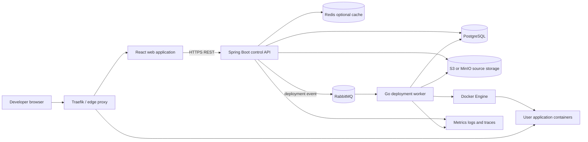

# FlyNow product and infrastructure PRD

## 1. Product summary

FlyNow is a small platform-as-a-service (PaaS). A developer creates an account,
creates an application, supplies source code and configuration, and asks FlyNow
to build and run that application.

The product is split into two planes:

- **Control plane:** React and Spring Boot manage users, applications,
  configuration, source metadata, readiness, and deployment requests.
- **Runtime plane:** Go workers perform slow and privileged operations such as
  source checkout, image builds, container lifecycle, and health reporting.

Spring Boot remains the public API. Go must not duplicate authentication,
application ownership, or user-management logic.

## 2. Product goal

Deliver this user journey:

```text
Register or log in
        ↓
Create application
        ↓
Upload ZIP or connect source
        ↓
Configure Dockerfile, port, and environment
        ↓
Pass readiness validation
        ↓
Request deployment
        ↓
Build image and start container
        ↓
Receive a public URL and deployment status
```

## 3. Users

### Developer

- Registers and manages their profile.
- Creates and owns applications.
- Configures source, container settings, and environment variables.
- Deploys, observes, restarts, and stops their own applications.

### Administrator

- Manages user status and roles.
- Views platform health and failed deployments.
- Can suspend abusive applications and users.

## 4. Scope

### MVP control plane

- Username/password authentication, JWT access tokens, refresh sessions, logout,
  and password recovery.
- User profile and administrator user management.
- Application CRUD with strict ownership checks.
- ZIP source upload and safe extraction.
- Dockerfile path, internal port, health-check path, and environment variables.
- Deployment-readiness validation.
- React dashboard for all of the above.

### First runtime release

- Durable deployment request.
- Go worker consumes one deployment job at a time.
- Controlled Docker image build and container lifecycle.
- Deployment logs and status updates.
- Traefik route creation and HTTPS public URL.
- Retry-safe processing and failure reporting.

### Not in the first release

- Kubernetes or multi-node scheduling.
- Arbitrary user-provided build or run shell commands.
- Multiple regions, automatic scaling, billing, or marketplace features.
- MFA, passkeys, and social login.
- Redis as the system of record.

## 5. High-level architecture



### Component responsibilities

| Component | Responsibility | Must not do |
|---|---|---|
| React | Pages, forms, auth state, API calls, status display | Enforce security or contain secrets |
| Spring Boot | Public API, authentication, authorization, ownership, validation, metadata, readiness, deployment requests | Build images or control Docker directly |
| Go worker | Execute trusted deployment workflow, control Docker, stream logs, report results | Authenticate users or become a second public business API |
| PostgreSQL | Durable source of truth and transactional state | Act as a queue for long-running work without an outbox design |
| Object storage | Original source archives and build artifacts | Store searchable business records |
| Redis | Short TTL cache, rate limits, locks, and temporary status acceleration | Store the only copy of sessions, applications, or deployments |
| RabbitMQ | Durable asynchronous deployment commands and retries | Store final deployment history |
| Traefik | TLS termination and routing public hostnames | Decide application ownership or authorization |

## 6. Service boundaries and data ownership

### Spring Boot owns

- `users`, roles, and account statuses.
- Refresh sessions and password-reset tokens.
- Applications and user ownership.
- Source metadata and configuration.
- Environment-variable metadata and encrypted values.
- Deployment requests, deployment history, and user-visible status.
- The public REST/OpenAPI contract.

### Go owns

- Deployment execution state required by the worker.
- Image/container identifiers and runtime observations.
- Build and runtime log production.
- Docker and reverse-proxy integration.

For the first deployment release, both services may use one PostgreSQL cluster,
but each table has exactly one writing owner. Neither service may update the
other service's tables directly. Worker results should return through an
internal authenticated API or versioned event contract.

## 7. Main system flows

### Authentication

```text
React → POST /api/auth/login → Spring Security → PostgreSQL
      ← access token response + secure refresh cookie

React → protected API with Bearer access token
      → Spring validates JWT and ownership
```

Refresh-token rotation remains in PostgreSQL initially. Redis can later enforce
distributed rate limits, but is not required to make authentication correct.

### Application setup

```text
React → Spring: create application
Spring → PostgreSQL: save owner and application
React → Spring: upload ZIP
Spring → object storage: save archive under generated object key
Spring → PostgreSQL: save source metadata
Spring: inspect safely and calculate readiness
React ← readiness checks and missing requirements
```

Spring must reject Zip Slip paths, oversized extracted content, excessive file
counts, and invalid Dockerfile paths. Uploaded code is never executed during
inspection.

### Deployment

```text
1. React asks Spring to deploy an application.
2. Spring authenticates the user and verifies application ownership.
3. Spring validates readiness.
4. One PostgreSQL transaction creates the deployment and outbox event.
5. An outbox publisher sends the deployment command to RabbitMQ.
6. A Go worker claims the command using the deployment ID as idempotency key.
7. The worker downloads source, builds an image, and starts a restricted container.
8. The worker configures routing and performs the health check.
9. The worker reports RUNNING or FAILED, timestamps, runtime IDs, and safe logs.
10. React polls the Spring API initially; WebSocket/SSE can be added later.
```

Required deployment states:

```text
DRAFT → READY → QUEUED → BUILDING → DEPLOYING → RUNNING
                           └───────────────→ FAILED
RUNNING → STOPPED
```

State transitions must be validated; a worker retry must not create a second
container for the same deployment.

## 8. Database and cache design

### PostgreSQL

Use PostgreSQL for all durable business data. Production schema changes use
versioned migrations run separately from application startup. Hibernate
`ddl-auto=update` is acceptable only for the current fresh local development
stage.

Core relationships:

```text
User 1 ── * Application 1 ── * Source
                       1 ── * EnvironmentVariable
                       1 ── * Deployment
Deployment 1 ── * DeploymentLogChunk (or external log object references)
```

Environment secrets must be encrypted before persistence. API responses expose
only the variable name and masked metadata, never plaintext or ciphertext.

### Redis adoption rule

Do not add Redis until one of these concrete needs exists:

- distributed login/API rate limiting;
- short-lived readiness or dashboard cache;
- distributed worker lock with an explicit expiration;
- temporary deployment log/status fan-out.

Every Redis value must have a TTL and be reconstructable from PostgreSQL,
RabbitMQ, object storage, or the running infrastructure.

## 9. API boundary

The browser calls only Spring Boot under `/api`. Go worker endpoints, if used,
are private and inaccessible from the public network.

Public API groups:

```text
/api/auth/**
/api/users/**
/api/admin/users/**
/api/applications/**
/api/applications/{id}/source
/api/applications/{id}/environment
/api/applications/{id}/readiness
/api/applications/{id}/deployments
/api/deployments/{id}
/api/deployments/{id}/logs
```

All application-scoped operations require an ownership check in the Spring
service layer, not only in React or the controller.

## 10. Security requirements

- TLS for every external connection; secure, HTTP-only refresh cookie.
- Short-lived signed access JWT and rotating refresh token.
- Password hashing using the configured Spring Security password encoder.
- RBAC plus application ownership checks.
- CSRF protection for cookie-backed state-changing authentication operations.
- Rate limits at the edge or Redis-backed application layer before production.
- Secrets supplied by a secret manager in production, never committed files.
- Isolated non-root application containers with CPU, memory, process, filesystem,
  network, and execution time limits.
- Go worker is privileged only for the minimum Docker operations and is never
  exposed publicly.
- Strict upload limits, archive validation, dependency/image scanning, and safe
  log redaction.

Running untrusted customer code through the Docker daemon is a major security
boundary. A production multi-tenant offering needs stronger isolation than a
basic shared Docker host. The first release should be treated as single-tenant
or trusted-user software.

## 11. Reliability and observability

- Correlation ID propagated React → Spring → queue → Go worker.
- Structured JSON logs without tokens, passwords, or environment values.
- Spring Actuator health/readiness endpoints.
- Go health/readiness endpoints and graceful shutdown.
- Metrics for API latency/errors, database pool, queue depth, deployment
  duration/failure, worker activity, and running containers.
- Deployment messages use acknowledgements, bounded retries, and a dead-letter
  queue.
- Outbox pattern prevents a committed deployment from losing its queue message.
- PostgreSQL and object storage are backed up and restoration is tested.

Initial service objectives after the MVP stabilizes:

- Public API availability: 99.9% monthly.
- 95th percentile normal API response: under 500 ms, excluding uploads.
- Deployment request accepted: under 2 seconds.
- No acknowledged deployment request is silently lost.

## 12. Environments and deployment topology

### Local development

```text
React dev server
Spring Boot local profile
Go worker (only when runtime work begins)
Docker Compose: PostgreSQL, optional MinIO, RabbitMQ, Redis, Traefik
Docker Engine: sample application containers
```

Only start infrastructure that the current feature needs. Authentication and
application CRUD require PostgreSQL, not Redis or RabbitMQ.

### Production v1

- React static assets served behind Traefik.
- At least one Spring Boot API process.
- At least one independently scalable Go worker.
- Managed or backed-up PostgreSQL.
- Durable object storage.
- RabbitMQ when deployment is enabled.
- Redis only after a defined caching/rate-limit requirement.
- Centralized secret management, logs, metrics, and alerts.

## 13. Delivery phases

### Phase 1 — complete the control-plane foundation

1. Keep the completed auth and user modules stable.
2. Add Spring application/project CRUD and ownership.
3. Add React authentication and application dashboard.
4. Add secure source upload, configuration, environment variables, and
   readiness.
5. Add automated security, ownership, repository, and integration tests.
6. Restore versioned database migrations before production.

Exit: the application reaches `READY` but the Deploy button does not execute
code.

### Phase 2 — deployment runtime

1. Freeze a versioned deployment command/result contract.
2. Add deployment and outbox transactions in Spring.
3. Add RabbitMQ and a Go worker.
4. Implement restricted Docker build/run/stop and health checks.
5. Add Traefik routing, logs, retries, idempotency, and failure recovery.

Exit: one trusted user can reliably deploy a Dockerfile application to one
host and obtain a working URL.

### Phase 3 — production hardening

1. Add Redis-backed rate limiting if multiple API instances require it.
2. Add image/dependency scanning and stronger runtime isolation.
3. Add backups, dashboards, alerts, load tests, and disaster-recovery tests.
4. Add horizontal workers and deployment reconciliation.
5. Evaluate Kubernetes only after single-host constraints are measured.

## 14. Decisions to keep the project understandable

- Use a modular Spring monolith for the public control plane.
- Use Go only where it provides a clear runtime/worker boundary.
- Keep one public API instead of exposing both Spring and Go to React.
- Prefer asynchronous messages only for slow deployment work.
- Start with polling; introduce SSE/WebSocket only when live updates are needed.
- Start without Redis; introduce it for measured operational needs.
- Start with Docker Compose/single host; introduce Kubernetes only for proven
  scheduling or scaling needs.
- Keep each durable record and database table under one service owner.

## 15. MVP acceptance criteria

- A user can register, log in, refresh, log out, and recover a password.
- A user can manage only their own applications.
- A user can upload valid source without archive traversal or resource abuse.
- Secret environment values are encrypted and never returned.
- Readiness reports every missing deployment requirement.
- A deployment request is durable and processed at least once but produces at
  most one active deployment result.
- Failure is visible and retryable without corrupting state.
- A successful deployment receives a routed HTTPS URL.
- Logs contain no credentials or environment secrets.
